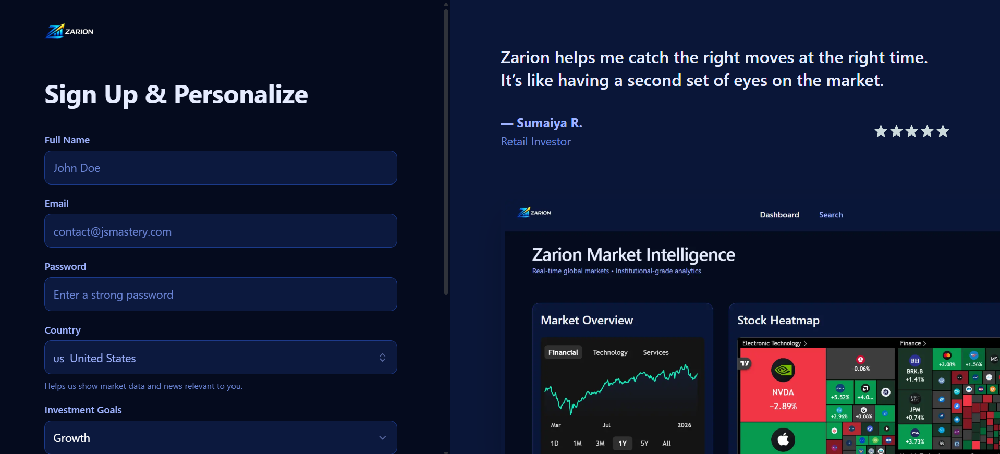
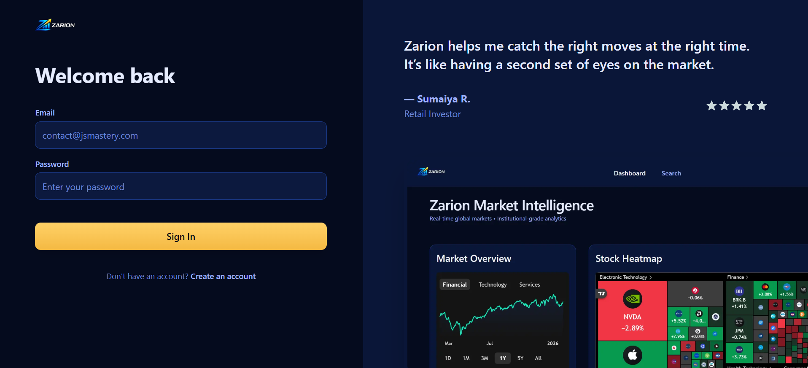
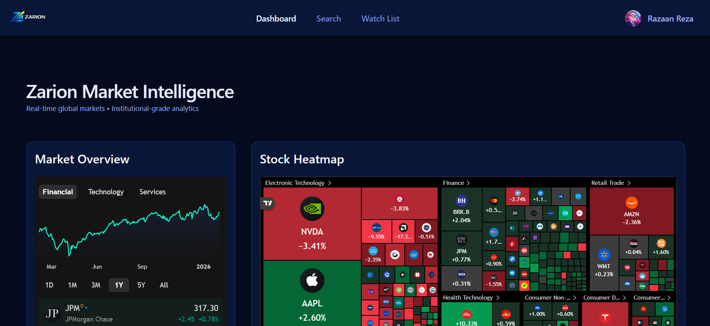
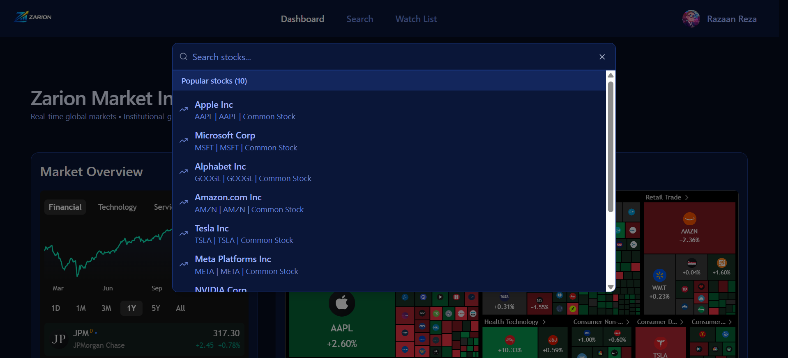
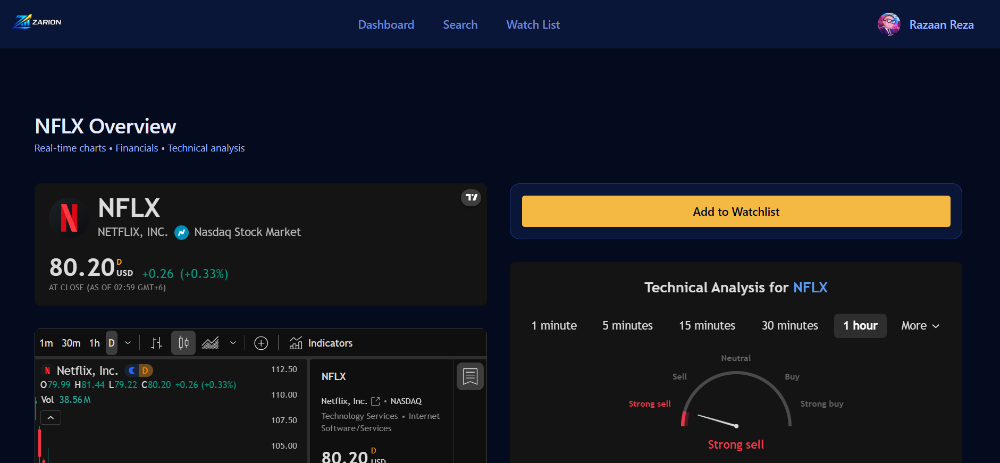
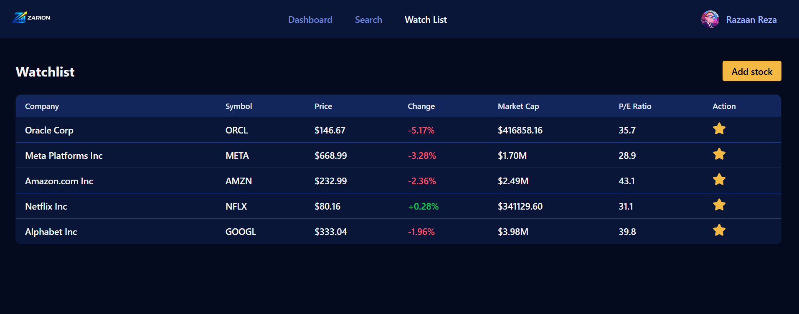

# 📈 Zarion — A Stock Tracker App

**Zarion** is a modern stock tracker application designed to simplify market monitoring with a clean, real-time dashboard. It enables users to track favorite stocks, analyze price movements, and stay on top of gains and losses—without unnecessary clutter.

Built for speed, clarity, and scalability, Zarion delivers a smooth experience inspired by institutional-grade market tools while remaining accessible to everyday users.

---

## 🚀 Features

* 📊 **Market Overview Dashboard**
  High-level snapshot of global market performance.

* 🔐 **Authentication & User Accounts**
  Secure sign-up and login system with protected routes and personalized user sessions.

* 🔥 **Stock Heatmap**
  Visual representation of market movements for quick insights.

* ⭐ **Watchlist Management**
  Add, remove, and monitor favorite stocks in real time.

* 🔍 **Command Palette**
  Quickly search stocks and execute actions using keyboard-first UX.

* 📈 **Real-Time Price Tracking**
  Live updates for stock prices and percentage changes.

* 🧭 **Clean, Focused UI**
  Designed for clarity—no noise, just what matters.

---

## 🧠 Tech Stack

* **Framework:** Next.js (App Router)
* **Language:** TypeScript
* **Database:** MongoDB
* **Styling:** Tailwind CSS
* **UI Components:** shadcn/ui
* **Auth:** better-auth
* **Background Jobs:** Inngest
* **Email:** Nodemailer

---

## 🛠️ Core Concepts Used

* CRUD operations with MongoDB
* Server & Client Components (Next.js)
* Secure authentication flows
* Event-driven background jobs
* Modular, scalable project structure
* Modern dashboard UI patterns

---

## 🖼️ Screenshots

### 🔐 Sign-up

### 🔐 Sign-in

### 📊 Market Overview Dashboard

### ⌨️ Search Palette

### ⌨️ Stock Details

### ⭐ Personalized Watchlist

